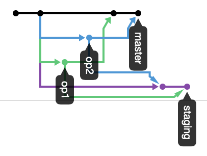
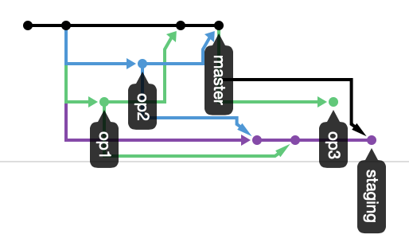

1. create `operation.md` file
1. add & commit `operation.md` file and push `master`  
`git add operation.md ; git commit -m "add operation.md" ; git push origin master`
1. create `staging`, `op1` and `op2` branch  
`git branch staging ; git branch op1 ; git branch op2`
1. push `staging`  
`git push origin staging:staging`
1. checkout `op1` branch  
`git checkout op1`
1. add & commit `operation.md` file and push `op1`  
`git add operation.md ; git commit -m "add operation.md" ; git push origin op1`
1. checkout `op2` branch  
`git checkout op2`
1. add & commit `operation.md` file and push `op2`  
`git add operation.md ; git commit -m "add operation.md" ; git push origin op2`
1. checkout `master` branch  
`git checkout master`
1. merge `op1` branch with `master` branch  
`git merge --no-ff op1`
1. merge `op2` branch with `master` branch  
`git merge --no-ff op2`  
*need to resolve conflicts*
1. checkout `staging` branch  
`git checkout staging`
1. merge `op2` branch with `staging` branch  
`git merge --no-ff op2`  
1. merge `op1` branch with `staging` branch  
`git merge --no-ff op1`
*need to resolve conflicts*
1. checkout `master` branch  
`git checkout master`
1. push `master` and `staging`  
`git push origin master:master ; git push origin staging:staging`
1. network at this time is as follows:  

1. create & checkout `op3` branch  
`git checkout -b op3`
1. fix & commit `operation.md` file and push `op3`  
`git add operation.md ; git commit -m "fix operation.md" ; git push origin op3`
1. create pull request to `staging` from `op3`
1. checkout `staging` branch  
`git checkout staging`
1. merge `master` branch with `staging` branch  
`git merge master --no-ff`
*Merge made by the 'recursive' strategy.*
1. push `staging`
`git push origin staging`
1. network at this time is as follows:  

1. checkout `op3` branch  
`git checkout op3`
1. fix & commit `operation.md` file and push `op3`  
`git add -A ; git commit -m "fix operation.md" ; git push origin op3`
